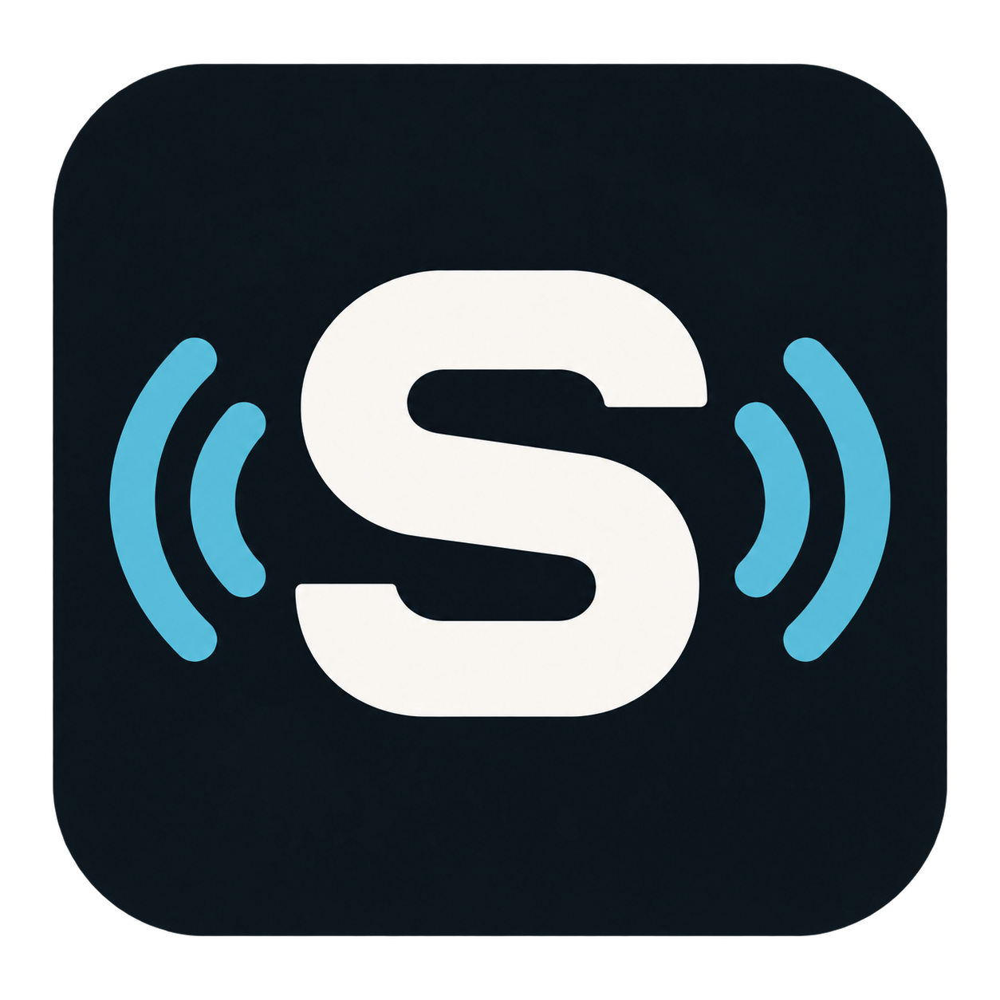

# PSVR2SimShaker



Leverage DCS World haptics for the Playstation VR2 (PSVR2) headset on PC, by Adam Chesters.

> [!WARNING]
> **ALPHA SOFTWARE — EXPECT TO TEST AND TUNE.** Effects and defaults are still being refined through live flights. Some cues may feel too strong, too weak or need timing adjustments for your setup. Use the individual effect tests and tuning controls to find your preferred mix; signal detection and aircraft coverage are still limited.

Windows x64; F/A-18C Hornet. PSVR2SimShaker reads DCS through its own export hook and shared-memory bridge. It works alongside seat and joystick haptics without requiring SimHaptic or TelemFFB.

## Prerequisites

- **[PSVR2Toolkit](https://github.com/BnuuySolutions/PSVR2Toolkit)** — install a compatible experimental build and **follow its [headset jailbreaking instructions](https://github.com/BnuuySolutions/PSVR2Toolkit/wiki/Jailbreaking-your-headset)**, including the required firmware/setup steps. Toolkit and `vr2jb.exe` are not bundled with this app.
- A PSVR2 headset connected to a Windows x64 PC, with its PC setup and SteamVR working.
- DCS World and the F/A-18C Hornet module for live flight effects.

## Current features

- Gear movement, gun bursts, touchdown, afterburner ignition and sustained rumble, store release, countermeasures, airborne buffet and subtle gear/speedbrake airflow.
- Optional engine and runway ambience, disabled by default.
- Per-effect switches, strength controls, isolated tests and expandable timing/response controls.
- Master, Mute, headset strength ceiling and an emergency-stop shortcut.
- A direct four-burst headset test and a demo flight with a highlighted timeline, using your enabled mix and saved gear travel time.
- Automatic effect output when valid Hornet telemetry and the headset are ready.
- Persistent indicators for the DCS hook, advancing simulator telemetry and aircraft data.
- Importable/exportable tuning profiles, connection diagnostics and a step-by-step `vr2jb.exe` guide.
- Per-user installer and portable ZIP. Closing the window keeps the app in the tray.
- Launch-time GitHub release checks, a green current-version / yellow update-available indicator, and a confirmed installer update that retains your tuning.

## Potential features

- More effects and richer event detection.
- More aircraft, beyond the initial F/A-18C Hornet target.
- More simulators, covering both racing and flight, including potential MSFS 2024 support.

These are possibilities for future development, not supported features or promised release dates.

## Getting started

Download the installer or portable ZIP from [Releases](https://github.com/AdamChesters/PSVR2SimShaker/releases).

**Headset haptics WILL NOT WORK if `vr2jb.exe` has not successfully unlocked the headset for the current power session. Installing PSVR2Toolkit alone is not enough.**

**Launch order: `vr2jb.exe` → SteamVR → PSVR2SimShaker → DCS.**

1. Exit **DCS, SteamVR, the PlayStation VR2 App and PSVR2SimShaker**. To exit SimShaker fully, use its tray menu or **Settings → Exit application**; the window's X only hides it.
2. Turn the headset on and keep it awake, with SteamVR still closed.
3. Run **`vr2jb.exe`** from the compatible [vr2jb release](https://github.com/BnuuySolutions/vr2jb/releases/tag/v1.0.1) and wait for a successful unlock. Complete the Toolkit jailbreaking instructions first; see the [setup guide](docs/SETUP.md) for the exact executable and steps.
4. Start **SteamVR** and wait for its headset indicator to show connected.
5. Launch **PSVR2SimShaker**. On first use, install the DCS hook from **Settings → DCS integration**.
6. Launch **DCS** and enter a Hornet mission. Effects run automatically. Master and Mute control output; tests are optional.

Repeat the unlock and launch order after powering the headset off. `vr2jb.exe` does not need to remain open.

The title area checks GitHub Releases at launch, including Alpha releases. **Current version** is green; **New version available** is yellow. Click it to review the version and choose **Download and install**. The app verifies the installer against GitHub's SHA-256 digest before opening it. Close DCS before installing; your saved tuning is retained. If the check cannot reach GitHub, the status stays grey and you can retry or open Releases manually. Portable users can use the installer in their current folder or download the ZIP from Releases.

The Toolkit exposes a single motor command from 10–25, plus zero for stop. This app shapes those commands into cues; it does not send audio samples to the headset. Damage/ejection effects are unavailable. Hornet signal quality, multiplayer restrictions and carrier behaviour need live-flight validation.

## Documentation

- [Setup and connection guide](docs/SETUP.md)
- [Effects and tuning](docs/EFFECTS.md)
- [Headset capabilities](docs/HARDWARE.md)
- [DCS signal reference](docs/TELEMETRY.md)
- [Shared-memory protocol](docs/PROTOCOL.md)
- [Testing and known limits](docs/TESTING.md)
- [Changelog](CHANGELOG.md)
- [Deferred features](docs/FUTURE_WORK.md)

## Build

Install Visual Studio 2026 C++ tools, CMake and vcpkg. Set `VCPKG_ROOT` to your vcpkg checkout:

```powershell
cmake --preset windows
cmake --build --preset release
ctest --preset release
```

Dependencies are pinned in `vcpkg.json`. For the installer and portable ZIP, install Inno Setup 6 and run `scripts/package.ps1`; use `-InnoCompiler` to select ISCC.exe if needed. No Sony firmware or Toolkit driver binaries are bundled.

## License and credits

GPL-3.0. See [third-party notices](THIRD_PARTY_NOTICES.md) and `licenses/` for upstream credits and licenses.
